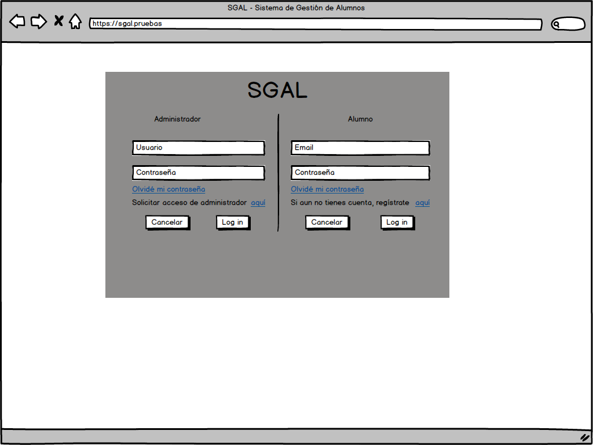
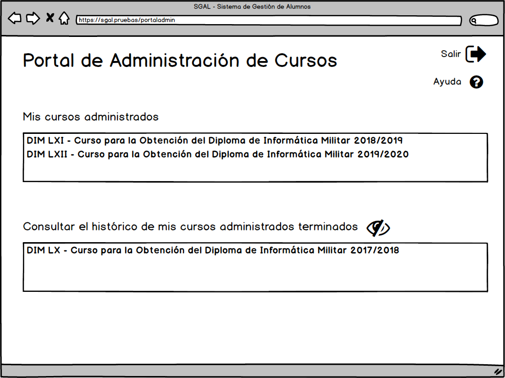
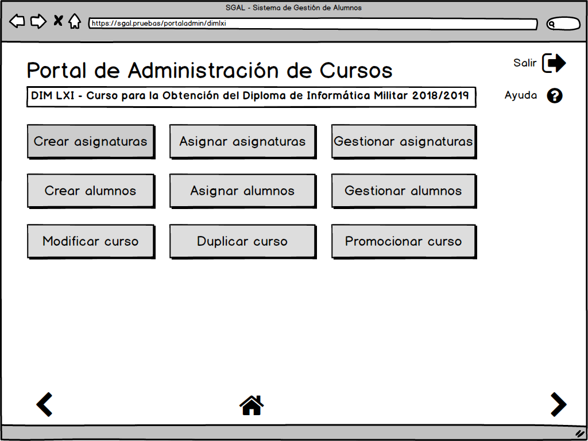
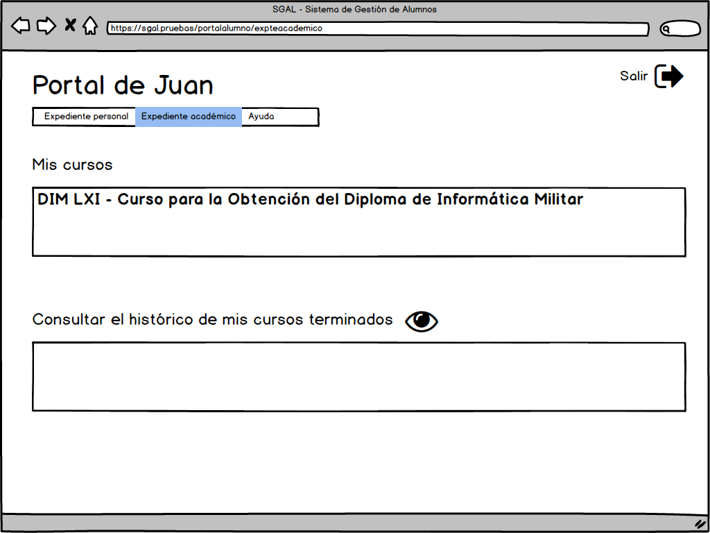
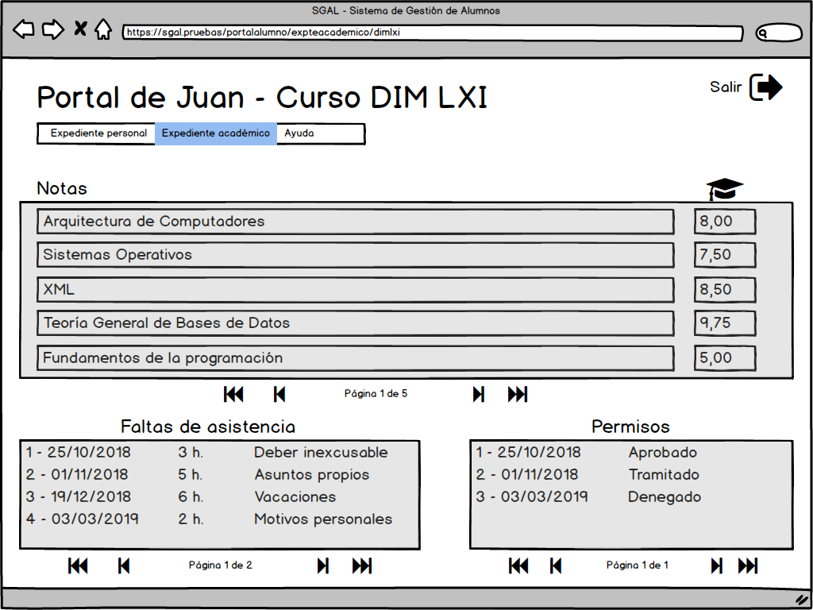
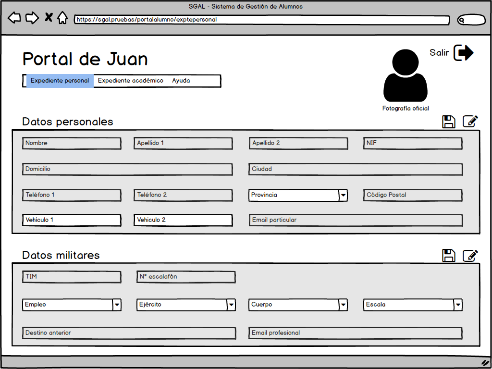

# **3.3.**        **ESPECIFICACIÓN DE FORMATOS INDIVIDUALES DE LA INTERFAZ DE PANTALLA.**

A continuación, se detallan a modo de ejemplo, cómo serían algunas de las ventanas por las que los usuarios navegarían:

*Vista de la interfaz para loguearse en la aplicación*

*Vista del Portal del Administrador del Departamento*

*Vista de la administración de un curso*

*Vista del expediente académico de un alumno en el Portal del Alumno*

*Vista de la información disponible de un curso en el Portal del Alumno*

*Vista del expediente personal de un alumno en el Portal del Alumno*
