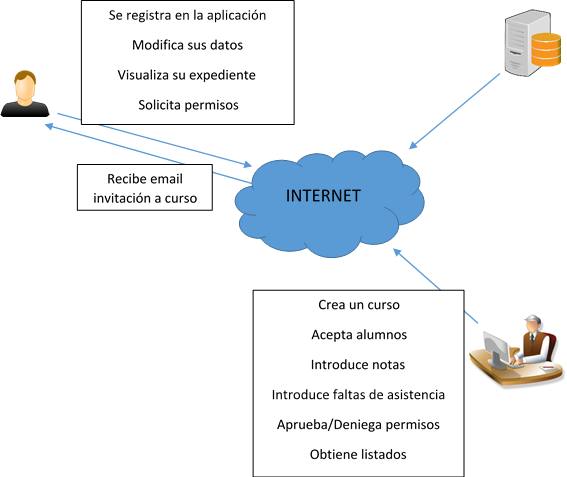

# **EVS 4.- ESTUDIO DE LAS ALTERNATIVAS DE SOLUCIÓN**

## **EVS 4.1.- PRESELECCIÓN DE ALTERNATIVAS DE SOLUCIÓN**

En lo que respecta a las alternativas hardware, se usarán los actuales equipos de los que ya disponen cada alumno y el DIC, así como los equipos particulares de los usuarios que tengan posibilidad de conexión a internet.

Como servidor de aplicaciones y de base de datos, se dispone de los servidores que posee el DIC, ubicado en la ACING en Hoyo de Manzanares (Madrid).

En lo que respecta a las alternativas software:

### - **Alternativa 1:**

-  Desarrollo de una aplicación en entorno WEB, en lenguaje JAVA y SGDB a definir.

### - **Alternativa 2:**

-  Compra de plataforma Comercial  [Additio](https://www.additioapp.com/es)

### - **Alternativa 3:**

-  Plataforma de Software Libre como [rosariosis](https://github.com/francoisjacquet/rosariosis)

## **EVS 4.2.- DESCRIPCIÓN DE LAS ALTERNATIVAS DE SOLUCIÓN**

### - **Alternativa 1:**

Supone crear una aplicación a medida que se adapte a las necesidades del DIC y cumpla todos los requisitos funcionales.

Al contar con los medios hardware del DIC, utilizar software de licencia libre y el trabajo de los alumnos, el coste de implementación sería cero.

A continuación, se describe de forma gráfica el modelo de negocio del sistema propuesto.

### - **Alternativa 2:**

El cambio es radical, pasando a usar una aplicación comercial, suficientemente probada y contrastada. Que si bien cumple la mayor parte de los requisitos funcionales, tiene innumerables opciones añadidas que no son de utilidad para el sistema que se necesita y que podría provocar confusión e incluso provocar un mal uso del sistema.

Este Sistema multiplataforma se basa en el uso de una plataforma desarrollada en la que los datos se almacenan en la empresa dueña del software.

El coste de esta aplicación es de 8,99 € por alumno al año.

### - **Alternativa 3:**

Al igual que la alternativa 2 el cambio es radical, con características similares, aunque los costes se reducirían (que no eliminarían). Posee licencia GPL (General Public License).