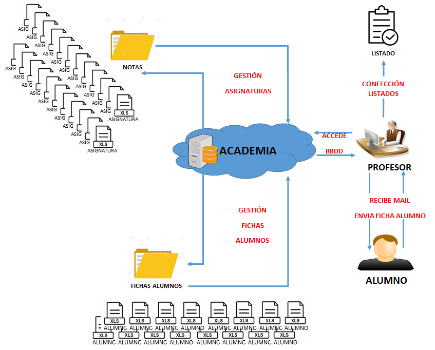

# **EVS 2.- ESTUDIO DE LA SITUACIÓN ACTUAL**

## **EVS 2.1.- VALORACIÓN DEL ESTUDIO DE LA SITUACIÓN ACTUAL**

El actual sistema de gestión de alumnos comprende una base de datos realizada en archivos independientes de Excel mediante la cual, se gestionan los diferentes listados de alumnos que se requieren durante la realización del curso DIM.

## **EVS 2.2.- IDENTIFICACIÓN DE LOS USUARIOS PARTICIPANTES EN EL ESTUDIO DE LA SITUACIÓN ACTUAL.**

- Equipo 1 de trabajo (3 alumnos)
- Cliente final: profesor de la asignatura.

## **EVS 2.3.- DESCRIPCIÓN DE LOS SISTEMAS DE INFORMACIÓN EXISTENTES**

El actual sistema de gestión de alumnos comprende una base de datos realizada en archivos independientes de Excel mediante la cual, se gestionan los diferentes listados de alumnos que se requieren durante la realización del curso DIM. Cada alumno rellena su &quot;Ficha de alumno&quot; cuando es nombrado alumno de la fase a distancia del curso. Esta ficha es archivada por parte del profesor tutor del curso.

El tutor es el que realiza los diferentes listados necesarios durante la realización del curso, quedando almacenados en local y cuyo acceso solo está permitido para él.

Los problemas que actualmente se observan con el sistema actual son:

- Archivado en local de los diferentes listados del curso.
- Acceso único por parte del tutor a dichos listados, siendo muy inaccesible por parte del resto de profesores/alumnos.
- Acceso desde local de los diferentes documentos.
- Los alumnos no pueden consultar sus propias notas.

Todo esto hace que el sistema sea ineficaz, haciendo muy viable una mejora sustanciosa que proporcione unas funcionalidades propias necesarias para el departamento.

## **EVS 2.4.- REALIZACIÓN DEL DIAGNÓSTICO DE LA SITUACIÓN ACTUAL**

Una vez valorado que el sistema actual es ineficaz, la solución pasaría por crear una aplicación informática que sustituya el método actual y resuelva, agilice y mejore el proceso de gestión de alumnos de los diferentes cursos DIM que se lleven a cabo en la Academia.

Dicha aplicación, deberá ser en entorno web, a la cual se podrá acceder desde cualquier ordenador conectado a internet, con identificación de usuarios mediante diferentes perfiles de acceso y privilegios y con datos almacenados en un Sistema Gestor de Base de Datos centralizado y seguro, lo que garantiza integridad y seguridad de los datos.
